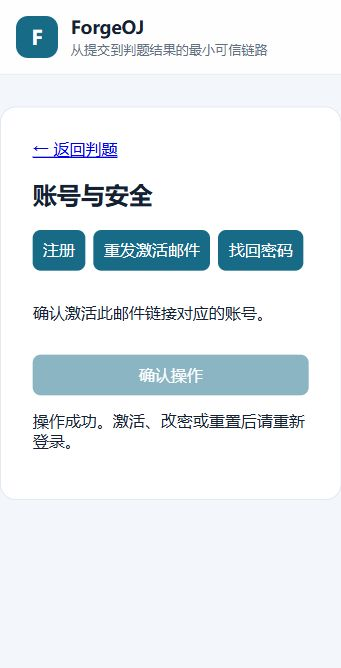
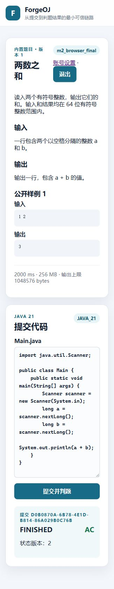
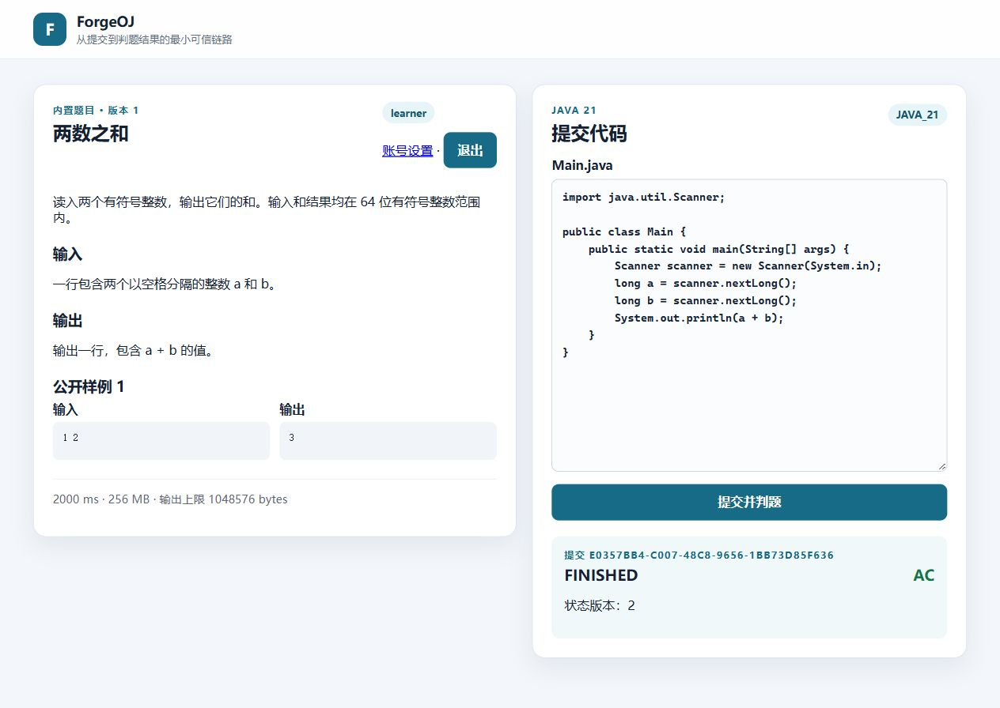

# 普通账号单元的独立验收事实

2026-10-02 最终固定 Linux API/Worker 产物在独立一次性数据库中执行；具体版本、源码清单、产物哈希、命令与失败修复记录见 [账号验收记录](../../M2-ACCOUNTS-VALIDATION.md)。

- `audit.json`：11 条提交的请求、Outbox、任务与 attempt 关联；10 条完成、1 条取消，4 个队列为空。
- `matrix.json`：八种实际 verdict 与三字段单调通知、终态关闭。
- `permissions.json`：匿名、其他所有者、不存在资源、跨源拒绝，以及退出关闭和排队取消。
- `browser.json`：实际浏览器观察的两条 QUEUED → FINISHED / AC；普通端口和阻断 WebSocket 的轮询端口分别关联提交。
- `account-log-check.json`：实际测试令牌、密码、邮箱与 JWT 未出现在运行日志中；只保留检查结论。
- `input-check.json`：188 个后端、前端与验证工具输入仍与最终构建清单一致。
- `cleanup.json`：精确清理本轮资源后核对容器、卷、网络和派生镜像为零，保留本地报告，没有全局 prune。

事实只包含平台标识与状态，不包含源码、隐藏测试、邮件令牌、Cookie、密码或生产数据。截图使用一次性新账号和开发预置账号；完整本地日志保留在忽略的 `target/`，未纳入仓库。截图和浏览器记录为实际操作证据，并非自动 UI 测试。账号单元已验证，完整 M2、真实 SMTP、云部署和 Release 尚未完成。

