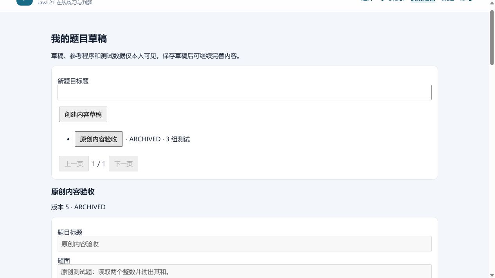
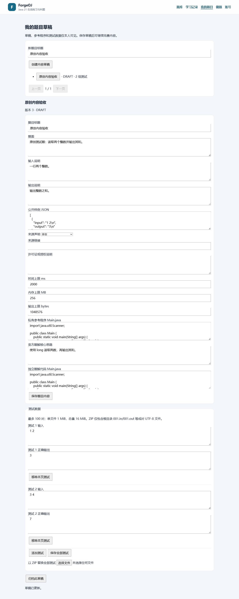
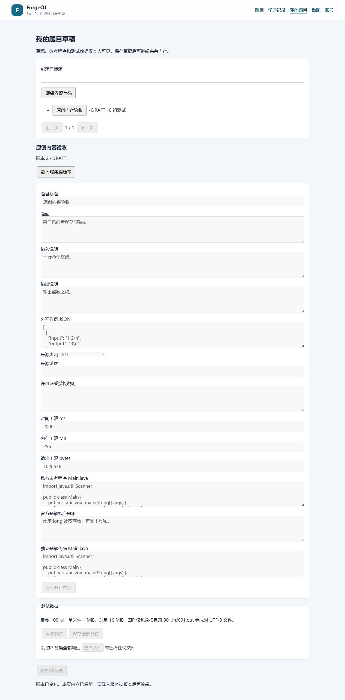

# M2 作者内容草稿阶段脱敏证据

2026-10-03，作者草稿阶段 VERIFIED；完整内容/M2 IN_PROGRESS。环境、命令、源码与构件哈希、失败和范围见 [验收报告](../../M2-CONTENT-VALIDATION.md)。

- `backend-summary.json` / `input-check.json`：固定 Linux 后端 261、前端 39/all checks、231 冻结输入全匹配。
- `content-browser.json`：真实页面创建/保存、实际 ZIP 选择器导入、非法 ZIP 保留旧数据、两页 CAS 冲突/显式载入、逐条测试和归档只读。
- `content-database.json`：未进入公共题库、未产生验证提交/AC、代码分列、未提交编辑不写库，归档 version 5/三组测试。
- `content-grants.json`：Worker 两种新表读取拒绝、API owner 列修改拒绝。
- `library.json` / `matrix.json` / `permissions.json` / `learning.json`：现有公开题库、八类实际判题、认证与学习边界重放。
- `browser.json` / `audit.json` / `queues.json`：正常和兜底真实 AC、11 正式任务/11 已发布消息/4 空队列及脱敏相关链。
- `cleanup.json`：daemon 可读且精确所有资源/managed sandbox 为 0。

截图与 ZIP 内容均为原创一次性 fixture，代码尚未经过作者内容的正式验证；不是已发布参考程序或官方题解。原始日志、JAR、ZIP 与其他截图保留于本机 target，未提交凭据/邮箱令牌或真实私有数据。

