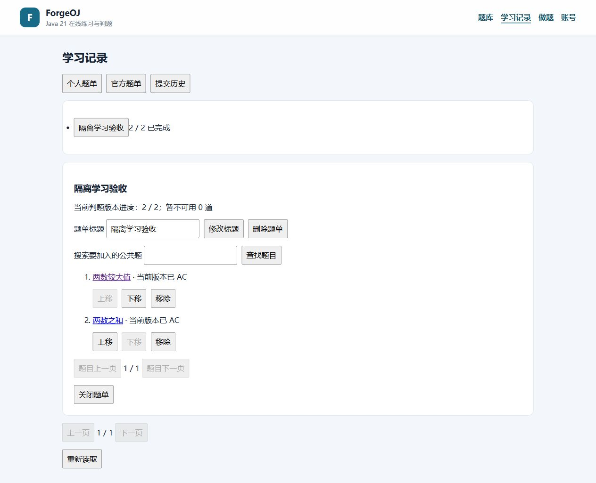
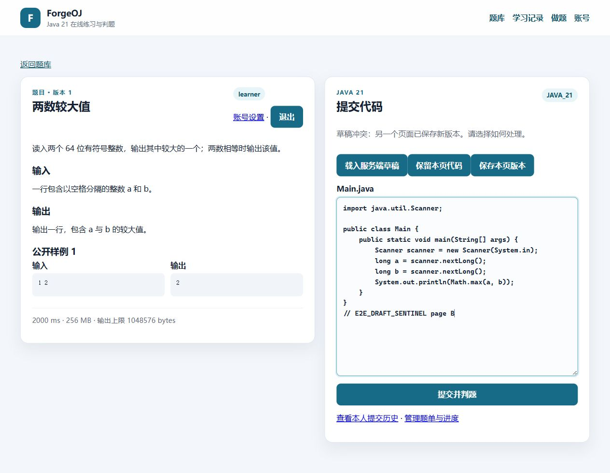
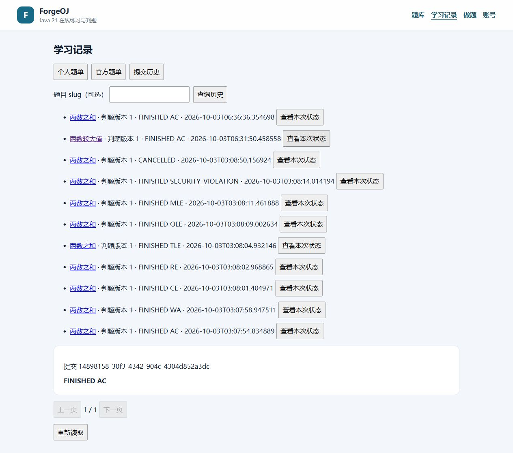

# M2 学习记录脱敏证据

2026-10-03，基线 `31a40d7` 的学习记录单元 VERIFIED，完整 M2 IN_PROGRESS。完整环境、命令、哈希、失败修复与范围见 [验收报告](../../M2-LEARNING-RECORDS-VALIDATION.md)。

- `backend-summary.json`：固定 Linux API 130/Worker 111，零失败、错误或跳过。
- `input-check.json`：最终构建副本 217 输入全部匹配；`post-replay-input-check.json`：204 业务输入不变，唯一 Replay 列级拒绝码断言修复的前后哈希。
- `learning.json`：真实 HTTP 所有者隔离、三类版本竞争、匿名官方白名单及提交历史；其中进度 1/2、历史 9 是浏览器提交之前的事实。
- `browser.json` / `learning-browser.json`：实际正常/兜底 AC、两页草稿冲突、后续进度 2/2、历史 11 及页面题单操作。
- `snapshot-independence.json`：后续草稿 version 5 不修改已完成的正式提交快照。
- `matrix.json` / `permissions.json` / `library.json`：八类实际 verdict、会话/通知/取消边界及公开题库。
- `audit.json` / `queues.json`：11 提交（10 完成、1 取消）、11 已发布 Outbox、4 空队列及脱敏任务链。
- `cleanup.json`：可读 daemon 上精确项目容器、卷、网络、Worker 镜像和 managed sandbox 都为 0。

截图仅为一次性测试账号与原创 fixture，不含生产账号、真实邮件令牌、密码、隐藏测试或参考程序。其他原始日志、构件和源码快照只保留在本机 target，不提交到 Git。

